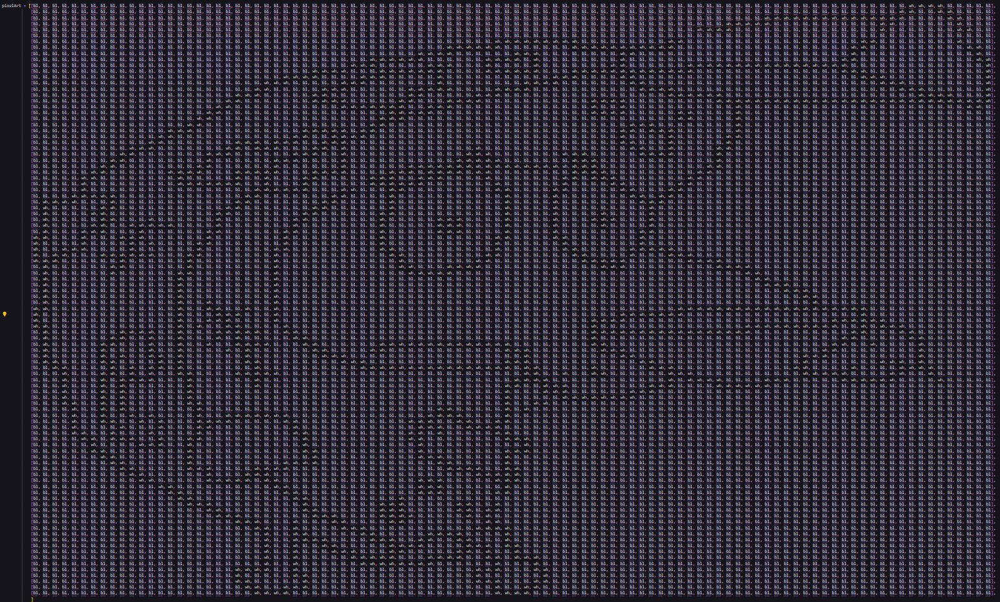

# Graficación
## Ejercicio 1. Carpeta pixelArt
Este folder contiene el primer ejercicio. Es una matriz llena de 0's y 255's creando la siguiente figura: 
  
La imagen en matriz queda de la siguente manera:  


>Nota: cambie los 0 por "wh" y los 255 por "bl" momentaniamente para que la matriz quedara bien alineada y se pueda apreciar mejor el pixel art.  
## Ejercicio 2. Operadores puntuales
En este ejercicio se pide Generar al menos cinco operadores puntuales utilizando la imagen generada o una imagen previamente cargada. Los operadores puntuales aplicados en este caso son
1. Escala de grises: Convertir la imagen a escala de grises.
2. Umbralización: Aplicar un umbral para binarizar la imagen.
3. Inversión de colores: Invertir los colores de la imagen.
4. Aumento de brillo: Aumentar el brillo de la imagen.
5. Aumento de contraste: Aumentar el contraste de la imagen.  
Siendo la imagen original la siguiente:  
  
Al aplicar las transfomaciones geometricas antes mencionadas tenemos como resultado:

 
## Ejercicio 3. Carpeta de Tranformaciones geometricas
esta carpeta contiene el ejercicio 3 de trasformaciones  
La primera ejercicio consiste en la rotacion de 60 grados en sentido a las manecillas del reloj, con una escala de 0.5, y una traslacion 10 pixeles en el eje x y 10 en el eje y.  
  


El segundo ejercicio consiste en una rotacion de 30 grados en sentido de las manecillas del reloj y 60 en contra de las manecillas del reloj dando un total de 30 grados en contra de las manecillas del reloj. ademas de un escalado de 2.
  


Por ultimo el tercer ejercicio es una transformacion con una rotacion de 70 grados en sentido de las manecillas del reloj, una escala de 2 y unas traslacion de 20 pixeles en el eje x y 20 en el eje y.
  

## Ejercicio 4. Que son las ecuaciones parametricas?
Las ecuaciones paramétricas son una herramienta muy útil para describir curvas y movimientos. Al introducir un parámetro, podemos obtener una representación más completa y flexible de las formas geométricas.  
### Algunas aplicaciones de las ecuaciones paramétricas:  
- Física: Describen el movimiento de proyectiles, planetas, etc.
- Ingeniería: Modelan diseños de curvas y superficies.
- Gráficos por computadora: Crean animaciones y efectos especiales.

## Ejercicio 5. Dibujo con primitivas

Para este ejercicio hay que crear un dibujo simple usando simplemente primitivas de dibujo
en este caso lo que yo cree fue un paisaje de una casa, detras unas montañas, el sol y una 
nube.  


## Ejercicio 6. Ecuaciones paramétricas

Para este ejercicio se pide cambiar el valor a "k" diez veces y observar el resultado.  
```python
# Parámetros de la curva de Limacon
a, b = 75, 50  # Reducir los valores de a y b para que la curva se ajuste mejor
k = 10 # Constante de multiplicación del ángulo
theta_increment = 0.05  # Incremento del ángulo
max_theta = 2 * np.pi  # Un ciclo completo
```
Con k = 1, el resultado es:  
  
Con k = 2, el resultado es:  
  
Con k = 3, el resultado es:  
  
Con k = 4, el resultado es:  
  
Con k = 5, el resultado es:  
  
con K = 6, el resultado es:  
  
Con k = 7, el resultado es:  
  
Con k = 8, el resultado es:  
  
Con k = 9, el resultado es:  
  
Con k = 10, el resultado es:  
  

## Ejercicio 7.
